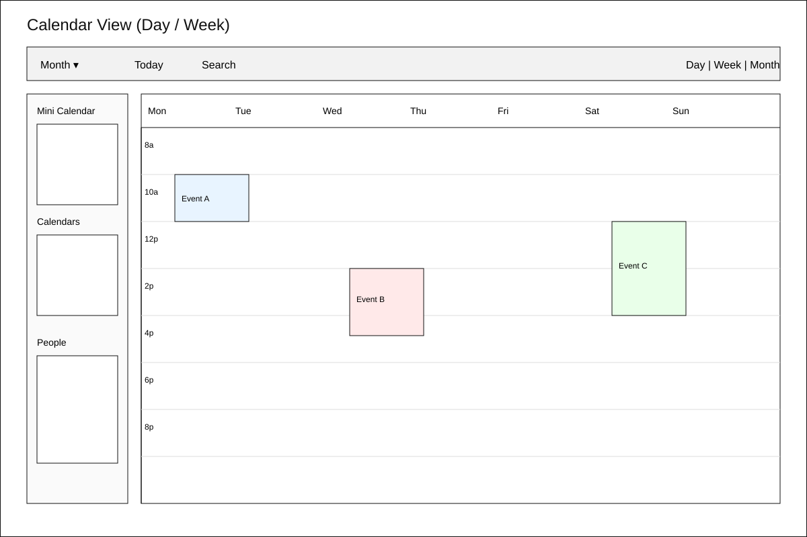
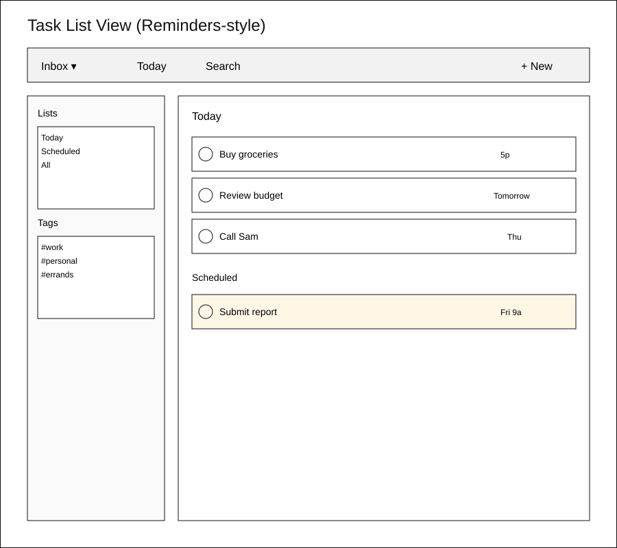
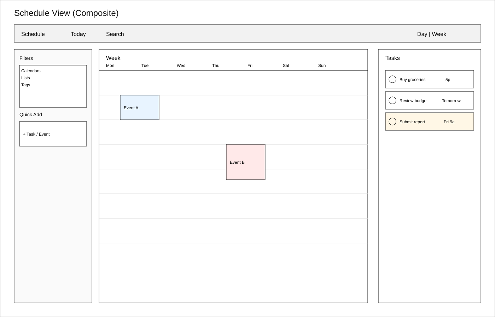

# Wireframes: Schedule View

## 1) Calendar day/week view

## 2) Task list view

## 3) Composite: Schedule View

## 4) Quick user pass (10-second find test)
**Prompt:** “Can you find your tasks and events in 10 seconds?”

**Heuristic pass (self-check):**
- Tasks are surfaced in a dedicated right rail with checkboxes and due times.
- Events are centered in a week grid with colored blocks.
- Filters/quick add live in the left rail to reduce hunting.

## 5) Iteration before build
**Adjustments made in this round:**
- Moved tasks into a persistent right rail to separate from the calendar grid.
- Simplified the top bar to “Schedule / Today / Search / Day|Week” for faster scanning.
- Kept filters in a left rail to avoid burying context.

**Open questions for the next pass:**
- Should the task rail be collapsible on smaller screens?
- Do we want a “task on calendar” mode that overlays due items onto the grid?
- How should overdue tasks be emphasized without stealing focus from events?
